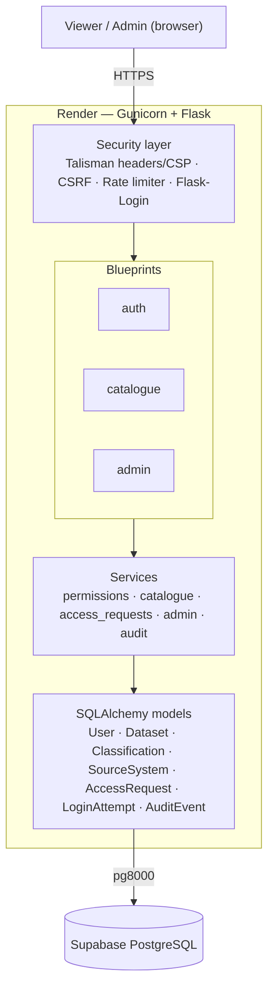
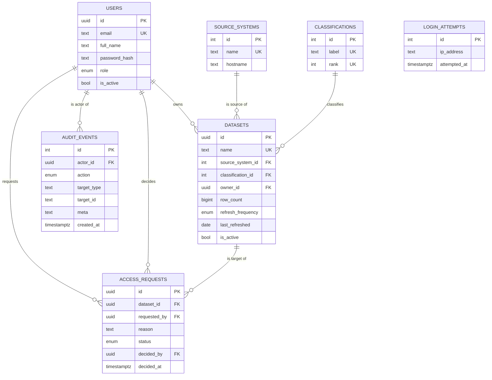

# Data Cataloguer

[](https://github.com/Y1I1/SWE-dataset-catalogue/actions/workflows/ci.yml)


A secure, centralised Flask web application for discovering datasets across an organisation and requesting access to sensitive ones through a formal approval workflow. Built as the secure-application component for the **Software Engineering and DevOps** module (Level 6 Digital & Technology Solutions degree apprenticeship).

Link to Application: https://dataset-catalogue.onrender.com

---

## Contents

- [The problem it solves](#the-problem-it-solves)
- [Features](#features)
- [Tech stack](#tech-stack)
- [Architecture](#architecture)
- [Project structure](#project-structure)
- [Data model](#data-model)
- [Security](#security)
- [Getting started](#getting-started)
- [Configuration](#configuration)
- [Test accounts](#test-accounts)
- [Running the tests](#running-the-tests)
- [Code quality](#code-quality)
- [Continuous integration](#continuous-integration)
- [Deployment](#deployment)
- [Health check](#health-check)
- [Known limitations & future work](#known-limitations--future-work)
- [Academic note](#academic-note)

---

## The problem it solves

In many large organisations data is heavily **siloed** — customer data in a CRM, financials in an ERP, analytics in a warehouse and a data lake, payments in a separate system. Different teams own different systems, there is **no single place to discover what data exists**, who owns it, how sensitive it is, or how fresh it is, and access is often granted ad hoc through email threads and spreadsheets with no audit trail.

**Data Cataloguer** attacks that problem directly. It provides one searchable catalogue of datasets spanning every source system, surfaces each dataset's owner, classification, row count and refresh cadence, and gates access to sensitive datasets behind an explicit admin approval workflow.

Sensitivity is modelled as ranked **classifications** (Public → Internal → Confidential → Restricted). Public and Internal datasets are visible to all signed-in staff; Confidential and Restricted datasets are gated until an administrator approves an access request. Viewers of gated datasets see only the dataset name and classification — source system and owner are masked until access is granted.

## Features

**Viewers** can:
- Browse and search the full dataset catalogue (free-text, by classification, by source system, sortable).
- View full metadata for any dataset they are entitled to see; gated datasets show only name and classification until approved.
- Request access to gated (Confidential/Restricted) datasets with a written justification.
- Track the status of their own access requests.
- Toggle password visibility on the sign-in form.

**Administrators** can do all of the above, plus:
- Manage datasets, classifications and source systems (create, edit, deactivate/delete).
- Manage users (edit role and active status).
- Approve or reject pending access requests.
- Every administrative action is recorded in an append-only audit log.

## Tech stack

| Layer | Choice |
|---|---|
| Language | Python 3.12 |
| Web framework | Flask 3.1 |
| ORM | Flask-SQLAlchemy 3.1 / SQLAlchemy 2.0 |
| Schema migrations | Flask-Migrate 4.0 / Alembic |
| Forms & CSRF | Flask-WTF + WTForms |
| Authentication | Flask-Login |
| Security headers / CSP | Flask-Talisman |
| Rate limiting | Database-backed login attempt tracking (`LoginAttempt` model) |
| Database (production) | PostgreSQL on Supabase (via the `pg8000` driver) |
| Database (tests) | SQLite (in-memory) |
| WSGI server | Gunicorn |
| Hosting | Render |
| CI | GitHub Actions + pip-audit |
| Tooling | black, isort, ruff, pytest, pytest-cov |

## Architecture

The application uses a layered architecture. HTTP requests pass through a security middleware layer, are routed by feature **blueprints**, delegate business logic to a **services** layer, and reach the database only through **SQLAlchemy models** — keeping route handlers thin and logic testable in isolation.



## Project structure

```
.
├── app/
│   ├── __init__.py            # App factory, extension init, CLI commands, routes
│   ├── config.py              # Dev / Test / Prod configuration classes + prod validation
│   ├── db.py                  # SQLAlchemy instance re-export
│   ├── errors.py              # 403/404/500/429 handlers
│   ├── extensions.py          # db, login_manager, csrf, limiter, talisman, migrate
│   ├── auth/                  # Registration, login, logout
│   ├── catalogue/             # Browse, search, dataset detail, access requests
│   ├── admin/                 # Dataset/classification/source-system/user management
│   ├── models/                # User, Dataset, Classification, SourceSystem, AccessRequest, LoginAttempt, AuditEvent
│   ├── security/              # role_required decorator
│   ├── services/              # permissions, catalogue, access_requests, admin, audit (business logic)
│   ├── static/                # CSS, JS and assets
│   └── templates/             # Jinja2 templates (auto-escaped)
├── migrations/                # Flask-Migrate / Alembic migration scripts
├── scripts/
│   ├── seed.py                # Idempotent demo-data seeding (dev only)
│   └── reset_password.py      # Reset one or all user passwords
├── supabase/
│   └── schema.sql             # Reference PostgreSQL schema (DDL)
├── tests/                     # pytest suite incl. dedicated security tests
├── .github/workflows/ci.yml   # Lint + security audit + test pipeline
├── render.yaml                # Render deployment blueprint
├── requirements.txt           # Pinned dependencies
├── pyproject.toml             # black / isort / ruff / pytest config
└── run.py                     # Entry point (gunicorn run:app)
```

## Data model

Seven tables with UUID primary keys for core entities and serial integers for lookups, a range of data types (UUID, TEXT, INT, BIGINT, BOOLEAN, DATE, TIMESTAMPTZ, ENUM), foreign-key relationships, and database-level integrity constraints:

- **`chk_decided`** — a decided access request must have both a decider and a decision timestamp; a pending one must have neither.
- **`uq_pending_request`** — a partial unique index preventing duplicate *pending* requests for the same dataset/user.
- **`chk_row_count_nonneg`** — dataset row counts cannot be negative.
- **`ix_login_attempts_ip_at`** — composite index on `(ip_address, attempted_at)` for efficient rate-limit window queries.

`login_attempts` records failed login attempts per IP address; records older than one hour are pruned automatically on each failed attempt, and all records for an IP are cleared on successful login.

`audit_events` is an append-only table. No UPDATE or DELETE routes exist for it. Every admin CRUD action (dataset, classification, source system, user role/status) and every access-request lifecycle event (created, approved, rejected) is written here.



## Security

Security is the focus of the application, with controls mapped to the **OWASP Top 10 (2021)** and verified by automated tests.

| OWASP category | Control in this app | Where | Verified by |
|---|---|---|---|
| **A01 – Broken Access Control** | Server-side role enforcement (`role_required`, 403 on failure); per-object permission check (classification-rank gate + approved-request lookup); gated dataset metadata masked on list and detail pages for viewers without access | `security/decorators.py`, `services/permissions.py`, `templates/catalogue/` | `test_viewer_cannot_access_admin`, `test_viewer_blocked_from_restricted_dataset`, `test_viewer_list_masks_gated_metadata` |
| **A02 – Cryptographic Failures** | Explicit **scrypt** password hashing (no implicit algorithm fallback); HTTPS forced in production; `HttpOnly` / `SameSite=Lax` / `Secure` session cookies | `models/user.py`, `config.py` | `test_password_hash_uses_scrypt`, `test_session_cookie_samesite_in_prod` |
| **A03 – Injection (SQLi & XSS)** | Parameterised queries via SQLAlchemy `ilike` (no string concatenation); Jinja2 auto-escaping on all output including stored data | `services/catalogue.py`, templates | `test_sqli_search_is_neutralised`, `test_xss_payload_is_escaped`, `test_stored_xss_escaped_in_list` |
| **A05 – Security Misconfiguration** | Talisman security headers + strict CSP; `DEBUG=False` in production; `validate_prod_config()` raises at startup if `SECRET_KEY` or `DATABASE_URL` is missing/insecure | `extensions.py`, `config.py` | `test_prod_config_debug_off`, `test_security_headers_in_prod`, `test_csp_header_present_in_prod` |
| **A07 – Identification & Auth Failures** | Password policy: ≥ 12 characters (NIST SP 800-63B — no mandatory character-class rules); database-backed login rate limiting (10 attempts/IP/minute, persists across Render cold-starts); attempts cleared on successful login; generic "Invalid email or password" message prevents user enumeration | `auth/forms.py`, `auth/routes.py`, `models/login_attempt.py` | `test_register_rejects_short_password`, `test_login_invalid_credentials`, `test_rate_limit_blocks_after_threshold`, `test_unknown_email_same_error_as_wrong_password`, `test_successful_login_clears_attempts` |
| **CSRF** (A01-adjacent) | Flask-WTF CSRF tokens on all state-changing forms | `extensions.py`, templates | `test_missing_csrf_rejected` |
| **Audit trail** | Append-only `AuditEvent` table records every CRUD action by admin users and every access-request lifecycle event | `models/audit_event.py`, `services/audit.py` | — |

## Getting started

### Prerequisites

- Python 3.12
- A database. For a zero-config local run you can use SQLite; for a shared/production-like setup use PostgreSQL (e.g. Supabase).

### 1. Clone and create a virtual environment

```bash
git clone https://github.com/Y1I1/SWE-dataset-catalogue.git
cd SWE-dataset-catalogue
python -m venv .venv
```

Activate it:

```bash
# macOS / Linux
source .venv/bin/activate

# Windows (PowerShell)
.venv\Scripts\Activate.ps1
```

### 2. Install dependencies

```bash
pip install -r requirements.txt
```

### 3. Configure environment variables

```bash
# macOS / Linux
cp .env.example .env

# Windows
copy .env.example .env
```

For the quickest local start, set a local SQLite database in `.env`:

```
DATABASE_URL=sqlite:///catalogue.db
SECRET_KEY=change-me-to-something-random
FLASK_CONFIG=dev
```

For a shared/production-like setup, point `DATABASE_URL` at your Supabase pooler URI instead (see [Configuration](#configuration)).

### 4. Initialise and seed the database

```bash
flask --app run.py init-db
flask --app run.py seed
```

`init-db` creates any missing tables (idempotent — safe to run on an existing database). `seed` is idempotent — it skips if users already exist.

To reset a single user's password at any time:

```bash
python scripts/reset_password.py user@example.com NewPassword123!
```

To reset **all** users at once (useful after a fresh database restore):

```bash
python scripts/reset_password.py --all CatalogueDemo2026!
```

### 5. Run the app

```bash
flask --app run.py run
```

Then open <http://127.0.0.1:5000> and sign in with one of the [test accounts](#test-accounts).

## Configuration

Configuration is environment-driven and selected by `FLASK_CONFIG` (`dev`, `test`, or `prod`).

| Variable | Required | Description |
|---|---|---|
| `DATABASE_URL` | Yes (dev/prod) | SQLAlchemy database URI. SQLite for local (`sqlite:///catalogue.db`); for Postgres on Supabase use `postgresql+pg8000://...` on the pooler port `6543`. Not needed for the test config (uses in-memory SQLite). |
| `SECRET_KEY` | Yes | Flask session signing key. Use a long random value in production. The `prod` config will refuse to start if this is missing or uses a known placeholder. |
| `FLASK_CONFIG` | No | `dev` (default), `test`, or `prod`. |
| `RESET_ALL_PASSWORDS` | No | When set, the `seed` command resets **every** user's password to this value on the next startup instead of skipping. Remove the variable after the first deploy so it does not run again. Useful for password resets without shell access (e.g. Render free tier). |

The `prod` configuration enables HTTPS enforcement, a strict Content-Security-Policy, secure cookies, `DEBUG=False`, and a `ProxyFix` middleware for running behind Render's proxy. It also validates that `SECRET_KEY` and `DATABASE_URL` are set to non-placeholder values at startup.

## Test accounts

Created by the seed script. Default password for all accounts: `CatalogueDemo2026!`

| Email | Role |
|---|---|
| admin@catalogue.test | Admin |
| viewer@catalogue.test | Viewer |
| steward@catalogue.test | Viewer |
| analyst@catalogue.test | Viewer |

## Running the tests

The suite covers authentication, catalogue, admin, the services layer, and a dedicated security module (CSRF, SQL injection, reflected and stored XSS, CSP headers, session cookie attributes, rate limiting, password hashing, metadata masking, production hardening).

```bash
# macOS / Linux
FLASK_CONFIG=test pytest

# Windows (PowerShell)
$env:FLASK_CONFIG = "test"; pytest
```

A **coverage gate of 80%** is enforced via `pyproject.toml` (`--cov-fail-under=80`); the run fails if coverage drops below that threshold.

## Code quality

Formatting and linting are enforced both locally and in CI.

```bash
black app tests scripts
isort app tests scripts
ruff check app tests scripts
```

## Continuous integration

Every push and pull request to `main` triggers the GitHub Actions pipeline (`.github/workflows/ci.yml`), which on Python 3.12:

1. Installs dependencies.
2. Runs **pip-audit** to flag known CVEs in the dependency tree.
3. Checks formatting with **black** and **isort**.
4. Lints with **ruff**.
5. Runs the **pytest** suite with the 80% coverage gate.

A pull request must pass all checks before it can be merged.

## Deployment

The app is deployed to **Render** as a web service, defined declaratively in `render.yaml`.

1. Push the repository to GitHub.
2. In [Render](https://render.com), create a **Web Service** from the repo (or use **New → Blueprint** so `render.yaml` is detected).
3. Set `DATABASE_URL` to your Supabase pooler URI (`postgresql+pg8000://...`, port `6543`). `SECRET_KEY` is generated automatically and `FLASK_CONFIG` is set to `prod` by the blueprint.
4. Deploy. On startup the service runs `init-db` (which creates any missing tables idempotently, including the new `audit_events` table on existing deployments), then starts Gunicorn:
   ```
   flask --app run.py init-db && gunicorn run:app --bind 0.0.0.0:$PORT
   ```
5. Open the Render URL and sign in with the test accounts.

> **Seeding on Render:** The seed command is intentionally excluded from the production startup command — it is a development-only command that will refuse to run in production. To populate demo data, set the `RESET_ALL_PASSWORDS` environment variable on the first deploy (see [Configuration](#configuration)).

## Health check

A lightweight endpoint at `/health/db` confirms database connectivity and is suitable for an uptime probe:

```json
{ "database": "connected" }
```

Errors are logged server-side only; the response body never exposes raw exception text.

## Known limitations & future work

Documented honestly to support critical evaluation. None of these block the core use case; they are the natural next iterations:

- **Open self-registration.** Anyone can register a viewer account. For an internal tool this would be better restricted to a verified email domain or gated behind admin approval.
- **No MFA or account lockout.** Authentication relies on password strength and database-backed rate limiting; multi-factor authentication and progressive lockout would harden it further.
- **Catalogue queries are unpaginated** and use lazy relationship loading. Eager loading and pagination would improve performance at scale.
- **The sensitivity boundary is rank-based** (`rank >= 3`). A dedicated `is_sensitive` flag on classifications would make the security boundary explicit and resistant to rank reordering.
- **Audit log is write-only.** The `audit_events` table is written on every admin action but there is no UI to browse or export the audit trail yet.

## Academic note

This repository was produced as coursework for the University of Roehampton **Software Engineering and DevOps** module (QAC020X328). It is shared for assessment and demonstration purposes.
